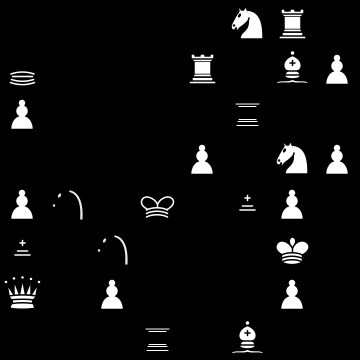
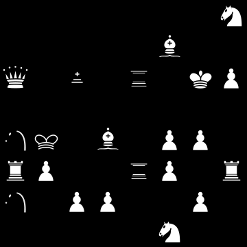
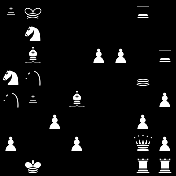
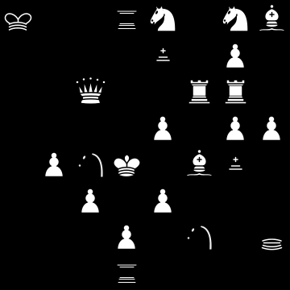
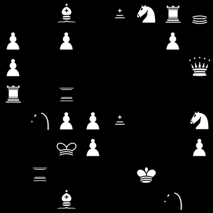
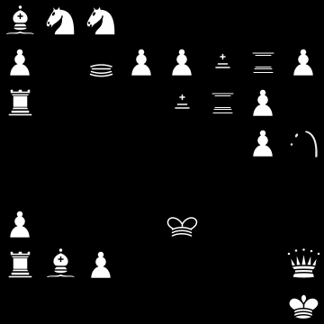
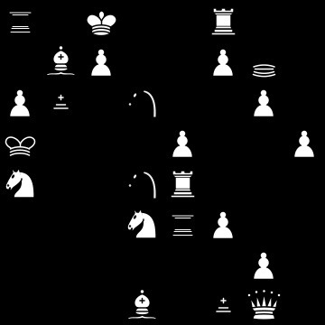

#Sample Boards

Each sample Good Chess board contains a link to Lichess's board editor so you can launch right into an online game against a friend or try your hand against Stockfish. Just click on "continue from here."

##Boards
###Score: -9.9  

FEN: `5NR1/q1p1R1BP/P1pp1rp1/p2pP1NP/Pn1k1bP1/b1n3K1/Q1Pp1pP1/3r1B2 w - - 0 1`    
[Lichess board editor](https://lichess.org/editor/5NR1/q1p1R1BP/P1pp1rp1/p2pP1NP/Pn1k1bP1/b1n3K1/Q1Pp1pP1/3r1B2%20w%20-%20-%200%201)

###Score: +22.8  

FEN: `7N/2p2B2/Q1b1r1KP/pp4p1/nkpB1PP1/RP2rPpR/npPP2P1/5N2 w - - 0 1`    
[Lichess board editor](https://lichess.org/editor/7N/2p2B2/Q1b1r1KP/pp4p1/nkpB1PP1/RP2rPpR/npPP2P1/5N2%20w%20-%20-%200%201)

###Score: +11.8  

FEN: `bk4r1/pN2p3/1Bp1PP1r/Nn3pqp/nb1B1p1P/1pP3Pp/P2P2QP/1K4RR w - - 0 1`    
[Lichess board editor](https://lichess.org/editor/bk4r1/pN2p3/1Bp1PP1r/Nn3pqp/nb1B1p1P/1pP3Pp/P2P2QP/1K4RR%20w%20-%20-%200%201)

###Score: -12.8  

FEN: `k2rN1NB/1pp1b1Pp/2Qp1RRp/4P1PP/pPnK1Bbp/2P1P3/p2P1n1q/3r4 w - - 0 1`    
[Lichess board editor](https://lichess.org/editor/k2rN1NB/1pp1b1Pp/2Qp1RRp/4P1PP/pPnK1Bbp/2P1P3/p2P1n1q/3r4%20w%20-%20-%200%201)

###Score: +16.2  

FEN: `2B1bNRq/P1Pp2P1/P2p2pQ/Rprpp3/1nPPbp1N/1pkP3P/1r3K2/2B3n1 w - - 0 1`    
[Lichess board editor](https://lichess.org/editor/2B1bNRq/P1Pp2P1/P2p2pQ/Rprpp3/1nPPbp1N/1pkP3P/1r3K2/2B3n1%20w%20-%20-%200%201)

###Score: +22.5  

FEN: `BNN5/P1qPPbrP/Rp2brP1/1p1pp1Pn/p5pp/P3k2p/RBP4Q/7K w - - 0 1`    
[Lichess board editor](https://lichess.org/editor/BNN5/P1qPPbrP/Rp2brP1/1p1pp1Pn/p5pp/P3k2p/RBP4Q/7K%20w%20-%20-%200%201)

###Score: +15.8  

FEN: `6B1/2PpqR2/3PBr2/pP2P1K1/n2Pr1bP/1ppRpNQp/N2P1p1P/k1b5 w - - 0 1`    
[Lichess board editor](https://lichess.org/editor/6B1/2PpqR2/3PBr2/pP2P1K1/n2Pr1bP/1ppRpNQp/N2P1p1P/k1b5%20w%20-%20-%200%201)

###Score: -21.7  

FEN: `r1K2R2/1BP2Pq1/Pb1n1pP1/k3P2P/Np1nRp1p/p1pNrP2/p1p3P1/3B1bQ1 w - - 0 1`    
[Lichess board editor](https://lichess.org/editor/r1K2R2/1BP2Pq1/Pb1n1pP1/k3P2P/Np1nRp1p/p1pNrP2/p1p3P1/3B1bQ1%20w%20-%20-%200%201)

